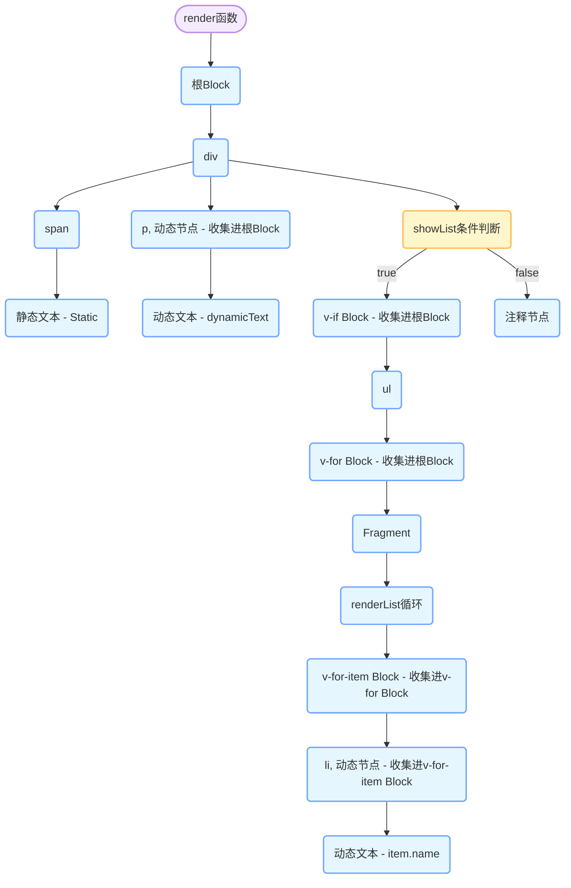

### **一、Block Tree 的设计目标**
- **缩小 Diff 范围**：仅追踪动态节点（如含 `v-if`、`v-for`、响应式绑定的节点），避免对比静态内容。
- **靶向更新（Targeted Updates）**：通过编译时标记的 `PatchFlag`，直接定位需要更新的属性。
- **减少递归层级**：将动态子树组织为扁平化的结构，提升遍历效率。

---

### **二、编译阶段：从模板到 Block Tree**
#### **1. 模板解析（Parse）**
- **输入**：Vue 单文件组件中的 `<template>` 内容。
- **输出**：抽象语法树（AST），包含节点类型、属性、子节点等信息。
- **关键行为**：
  - 识别静态节点（无动态绑定）、动态节点（如 `{{ value }}`、`v-if`）。
  - 标记动态绑定的类型（文本、属性、事件等）。

#### **2. 转换（Transform）**
在此阶段，Vue 编译器对 AST 进行优化，为生成 Block Tree 做准备：
- **静态提升（Hoist Static）**：
  - 将纯静态节点（如 `<div>Hello</div>`）提取到渲染函数外部，避免重复创建。
  ```js
  // 静态节点会被提升为常量
  const _hoisted_1 = /*#__PURE__*/_createVNode("div", null, "Hello", -1 /* HOISTED */);
  ```
- **标记动态节点**：
  - 为动态节点添加 `PatchFlag`，如 `TEXT`（1）、`CLASS`（2）、`PROPS`（8）等。
  ```js
  // 动态文本节点，标记为 TEXT（1）
  _createVNode("div", null, _ctx.value, 1 /* TEXT */);
  ```
- **构建 Block**：
  - **根 Block**：每个组件的模板根节点自动创建一个 Block。
  - **嵌套 Block**：遇到 `v-if`、`v-for` 等可能导致html结构改变的动态结构时，生成子 Block并进入子Block。
  - **动态子节点收集**：将 Block 内的动态子节点（包括嵌套 Block）记录到 `dynamicChildren` 数组中。


#### **3. 代码生成（Generate）**

将 AST 生成可运行的`render`函数代码，通过`openBlock()`和`createElementBlock()`创建新的 Block 节点并收集内部所有的动态子节点到`dynamicChildren`数组中。

- `openBlock()`：创建一个新的全局`dynamicChildren`数组，开始收集动态子节点。
- `createElementBlock()`：生成一个 Block 节点，遍历子节点并使用 `dynamicChildren` 数组存储所有动态子节点，最后存储`dynamicChildren`数组。

**示例模板**：
```html
<div>
  <span>Static</span>
  <p>{{ dynamicText }}</p>
  <ul v-if="showList">
    <li v-for="item in items" :key="item.name">{{ item.name }}</li>
  </ul>
</div>
```

**转换后的render函数代码**：
```javaScript
export function render(_ctx, _cache, $props, $setup, $data, $options) {
  return (_openBlock(), _createElementBlock("div", null, [
    _createElementVNode("span", null, "Static"),
    _createElementVNode("p", null, _toDisplayString(_ctx.dynamicText), 1 /* TEXT */),
    (_ctx.showList)
      ? (_openBlock(), _createElementBlock("ul", { key: 0 }, [
          (_openBlock(true), _createElementBlock(_Fragment, null, _renderList(_ctx.items, (item) => {
            return (_openBlock(), _createElementBlock("li", {
              key: item.name
            }, _toDisplayString(item.name), 1 /* TEXT */))
          }), 128 /* KEYED_FRAGMENT */))
        ]))
      : _createCommentVNode("v-if", true)
  ]))
}
```

**转换后的Block Tree 示例**




---

### **三、运行时阶段：Block Tree 的更新流程**
#### **1. 首次渲染**
- **执行渲染函数**：生成包含 Block 的虚拟 DOM 树。
- **构建 Block Tree**：
  - 每个 Block 节点记录自己的 `dynamicChildren`（动态子节点列表）。
  - 静态节点直接引用提升后的常量，无需处理。

#### **2. 响应式数据变更**
当响应式数据（如 `dynamicText`、`showList`、`items`）变化时：
1. **触发组件更新**：依赖收集系统（Reactivity System）通知组件重新渲染。
2. **重新执行渲染函数**：生成新的虚拟 DOM 树（包含新的 Block 结构）。

#### **3. Diff 过程（Patch）**
Vue 的 Diff 算法会优先利用 Block Tree 进行靶向更新：
- **Block 对比**：
  - 新旧虚拟 DOM 树的根 Block 类型相同，进入 Block 内部对比。
  - 直接对比 `dynamicChildren` 数组，而非全量子树。
- **动态子节点更新**：
  - 对 `dynamicChildren` 中的每个节点，根据 `PatchFlag` 执行精准更新：
    - 若 `PatchFlag` 为 `TEXT`：仅更新文本内容。
    - 若 `PatchFlag` 为 `CLASS`：仅对比 class 属性。
  - 若子节点自身是 Block（如 `v-for` 列表），递归对比其 `dynamicChildren`。

**示例：列表更新（v-for）**
- 当 `items` 数组变化时：
  1. 对比新旧 `dynamicChildren` 中的 `li` Block。
  2. 通过 `key` 复用相同项，移动或增删节点。
  3. 仅更新发生变化的 `item.name`（通过 `PatchFlag` 标记的文本节点）。

#### **4. 静态内容跳过**
- 静态节点（如 `<span>Static</span>`）在 Diff 时直接被跳过，无需对比。

---

### **四、关键优化点**
#### **1. 扁平化的动态子树（dynamicChildren）**
- Block 内的动态子节点以数组形式扁平化存储，无需递归遍历整棵树。
- 对比时只需遍历 `dynamicChildren` 数组，时间复杂度为 O(n)。

#### **2. PatchFlag 按需更新**
- 动态节点携带 `PatchFlag`，直接指示需要更新的属性类型。
- 例如，仅 `TEXT` 变化的节点不会对比 `class` 或 `style`。

#### **3. 靶向 DOM 操作**
- 通过 `dynamicChildren` 直接定位到变化的节点，避免全树遍历。

---

### **五、全流程总结**
1. **编译阶段**：
   - 静态提升、标记 `PatchFlag`、构建 Block Tree。
2. **首次渲染**：
   - 生成包含 `dynamicChildren` 的 Block 结构虚拟 DOM。
3. **数据变更**：
   - 响应式系统触发组件重新渲染。
4. **更新阶段**：
   - 生成新 Block Tree，通过对比 `dynamicChildren` 和 `PatchFlag` 执行靶向更新。
5. **DOM 操作**：
   - 仅更新标记的动态部分，静态内容完全跳过。

---

### **六、与 Vue 2 的对比**
| **特性**         | **Vue 2**                     | **Vue 3 (Block Tree)**         |
|-------------------|-------------------------------|--------------------------------|
| **Diff 范围**     | 全树递归对比                 | 仅对比动态子树（dynamicChildren） |
| **静态处理**      | 无静态提升，全量对比         | 静态节点提升，完全跳过         |
| **更新粒度**      | 组件级或全节点对比           | 属性级（通过 PatchFlag）       |
| **列表优化**      | 双端对比，无 Block 分组      | 动态子树分组，减少对比范围     |

---

### **七、应用场景示例**
假设一个组件包含大量静态内容和少量动态绑定：
```html
<div>
  <!-- 大量静态 HTML 结构 -->
  <header>...</header>
  <main>...</main>
  <footer>...</footer>
  
  <!-- 动态部分 -->
  <p>{{ dynamicText }}</p>
</div>
```
- **Vue 3 的优势**：  
  - 静态内容被提升，Diff 时完全跳过。  
  - 动态文本节点通过 `PatchFlag` 直接更新，无需遍历其他节点。

---

通过 **Block Tree** 的设计，Vue 3 在编译时和运行时实现了深度优化，将虚拟 DOM 的 Diff 成本降至最低，特别适合复杂但动态部分较少的页面场景。


