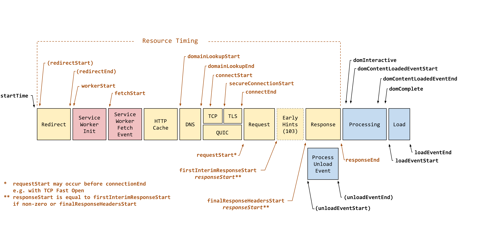

在 JavaScript 中，可以通过浏览器提供的 `Performance API` 获取页面性能指标数据。以下是详细方法和常见性能指标的获取方式：

---

### 一、基础 API：`window.performance`
浏览器通过 `window.performance` 对象暴露性能数据，主要包含以下核心接口：

#### 1. **Navigation Timing (导航计时)**
用于获取页面加载各阶段的时间戳，如 DNS 查询、TCP 连接、DOM 解析等。

```javascript
const timing = window.performance.getEntries({ entryType: 'navigation' })[0];

// 示例：计算页面完全加载时间
const loadTime = timing.loadEventEnd - timing.navigationStart;
console.log(`页面完全加载耗时：${loadTime}ms`);

// 其他关键时间点：
const dnsTime = timing.domainLookupEnd - timing.domainLookupStart; // DNS 查询耗时
const tcpTime = timing.connectEnd - timing.connectStart; // TCP 连接耗时
const domReadyTime = timing.domContentLoadedEventEnd - timing.navigationStart; // DOM 解析完成时间
```

**按照事件发生的先后顺序，timing可获取的事件时间列表如下：**

 - startTime
 - redirectStart
 - redirectEnd
 - workerStart
 - fetchStart
 - domainLookupStart
 - domainLookupEnd
 - connectStart
 - secureConnectionStart
 - connectEnd
 - requestStart
 - responseStart
 - unloadEventStart (上一个文档)
 - unloadEventEnd （上一个文档）
 - responseEnd
 - domInteractive
 - domContentLoadedEventStart
 - domContentLoadedEventEnd
 - domComplete
 - loadEventStart
 - loadEventEnd



#### 2. **Performance Timeline (性能时间线)**
通过 `performance.getEntries()` 或 `performance.getEntriesByType()` 获取更详细的资源加载性能数据。

```javascript
// 获取所有性能条目
const entries = performance.getEntries();

// 获取特定类型的条目（如资源加载、导航、绘制等）
const navEntries = performance.getEntriesByType("navigation"); // 页面导航条目
const resourceEntries = performance.getEntriesByType("resource"); // 资源加载条目
```

---

### 二、关键性能指标（Web Vitals）
现代浏览器支持通过 `PerformanceObserver` 监听关键性能指标：

#### 1. **首次内容绘制（FCP, First Contentful Paint）**
```javascript
const observer = new PerformanceObserver((list) => {
  const entries = list.getEntries();
  for (const entry of entries) {
    if (entry.name === "first-contentful-paint") {
      console.log("FCP:", entry.startTime);
      observer.disconnect(); // 停止监听
    }
  }
});

observer.observe({ type: "paint", buffered: true });
```

#### 2. **最大内容绘制（LCP, Largest Contentful Paint）**
```javascript
const observer = new PerformanceObserver((list) => {
  const entries = list.getEntries();
  const lastEntry = entries[entries.length - 1]; // 取最后一次（最准确的 LCP）
  console.log("LCP:", lastEntry.renderTime || lastEntry.loadTime);
});

observer.observe({ type: "largest-contentful-paint", buffered: true });
```

#### 3. **首次输入延迟（FID, First Input Delay）**
```javascript
const observer = new PerformanceObserver((list) => {
  const entries = list.getEntries();
  for (const entry of entries) {
    const delay = entry.processingStart - entry.startTime;
    console.log("FID 延迟:", delay);
    observer.disconnect();
  }
});

observer.observe({ type: "first-input", buffered: true });
```

#### 4. **累积布局偏移（CLS, Cumulative Layout Shift）**
```javascript
let clsValue = 0;
let sessionValue = 0;

const observer = new PerformanceObserver((list) => {
  for (const entry of list.getEntries()) {
    if (!entry.hadRecentInput) {
      sessionValue += entry.value;
      clsValue = Math.max(clsValue, sessionValue);
    }
  }
  console.log("CLS:", clsValue);
});

observer.observe({ type: "layout-shift", buffered: true });
```

---
