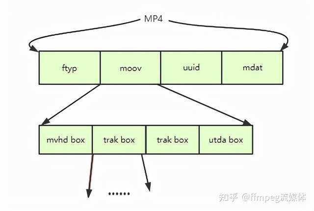
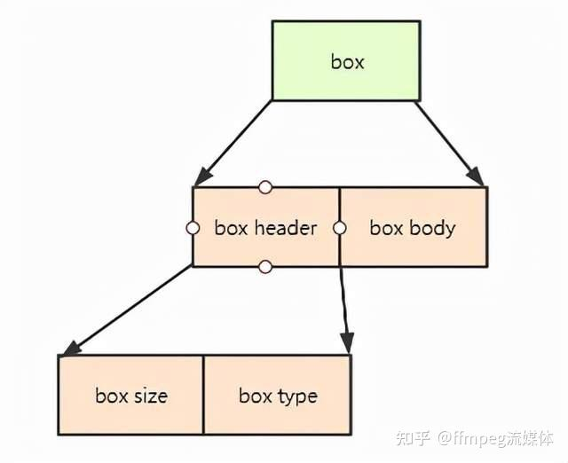
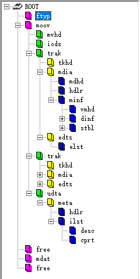
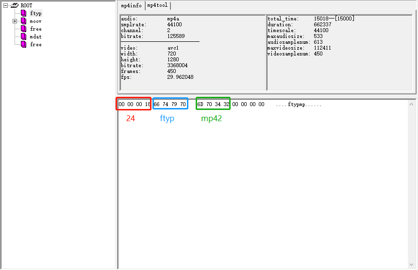
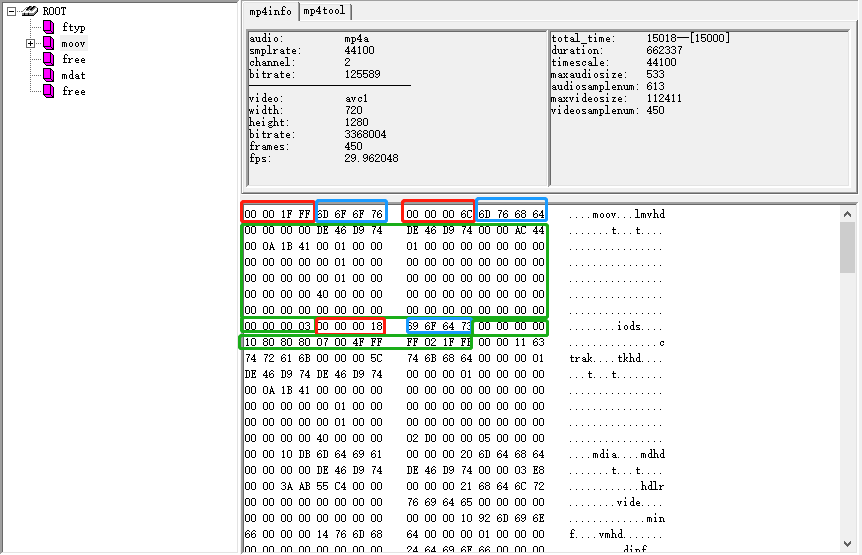
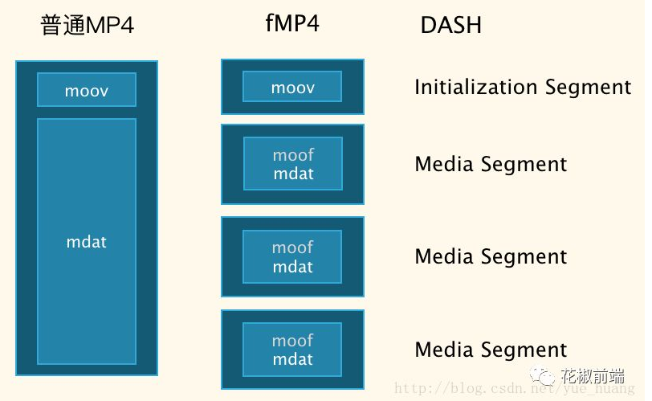
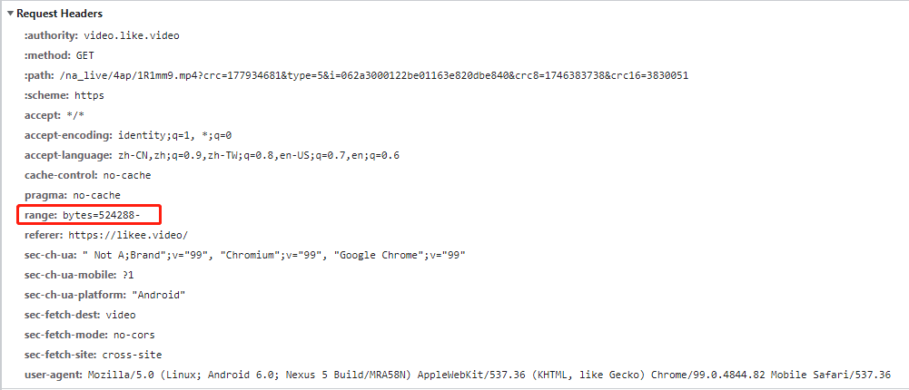
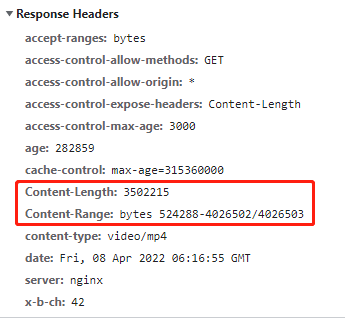

### 页面自动播放限制

[网页视频autoplay兼容及解决方案](https://github.com/bigo-frontend/blog/issues/88)

### 视频播放/格式/传输原理

1. **影响视频清晰度的因素有：分辨率（视频与显示设备的匹配度），帧率（对高速运动视频影响大），帧内压缩算法**
2. **影响视频体积（码率）的因素有：分辨率，帧率，压缩算法**
3. **短视频的业务场景下，应尽量避免使用多mdat的视频文件，会造成不必要的开销**
4. **web场景下视频优化方向是在保证清晰度的情况下，尽可能降低码率，以提升视频资源的加载速度**

#### 视频的播放原理

视频的播放原理类似幻灯片的快速切换，每次切换的画面，称为一帧；每秒切换帧数称为帧率

**分辨率**

像素是显示设备上发光原件的最小单位，每幅画面都是由像素点阵组成的

分辨率表示视频每一帧包含的像素，以水平方向的像素数量×垂直方向的像素数量来表示，比如1920×1080

当视频的分辨率低于显示设备的分辨率时，设备上的像素点多于视频显示所需的像素点，这时就会用上各种补间算法来为显示设备上那些未被利用的像素点生成色值信息，以完全点亮显示设备的所有像素点，否则将会导致屏幕上出现黑点

因为那些像素上的信息是算法生成的，所以当视频的分辨率明显小于显示设备的分辨率时，这样的像素点就会变得过多，从而导致感官上的清晰度下降。如果视频的清晰度超过设备的分辨率上限，多出的信息会被丢弃，也不会呈现更好的效果

所以视频分辨率需要同时结合显示设备的分辨率才能呈现出更好的视觉效果
 

**帧率**

人类对画面切换频率的感知度有一个范围，一般60帧/秒左右是一个比较合适的范围
但这并不是绝对的，在需要记录一个快速运动的镜头时，准备足够的帧数才能捕捉到细微的变化；当拍摄一个缓慢的镜头推进的效果时，帧率并不需要太高，分辨率会起到更高的作用
帧率的选取除了需要结合播放内容，还需要结合显示设备的刷新频率，否则选取了过高的帧率而显示设备不支持的话，多余的帧也只会被丢弃

**视频压缩**

如上文所述，只要保存了视频每帧的画面和帧率，就可以实现视频的保存了，这正是胶片时代保存视频的方式
 
然而，在信息时代，我们可以通过压缩视频以满足在互联网上快速传播的需求
视频压缩的一般思路是：帧内压缩+帧间压缩

**帧内压缩**

帧内压缩的原理与图片压缩的原理基本一致

**帧间压缩**

设定关键帧，抛弃其他帧，具体的画面内容靠关键帧的数据按算法进行预测
在音视频中，为了提高压缩效率，会将每帧画面压缩为不同类型的视频帧数据
I帧：表示关键帧，包含有一帧画面的完整信息，解码时只需要本帧数据就可以解码出完整的一帧画面
P帧：表示前向参考帧，它保存了本帧与上一帧的差异信息，它不能单独解码，需要根据上一帧的画面加上本帧保存的差值来获取本帧的完整画面
B帧：为双向参考帧，它解码时需要依赖它之前和之后的帧来获取最终的画面
因为B帧需要依赖它后面的帧来进行解码，所以它的解码顺序就必然和显示顺序不能保持一致，这时就需要解码时间戳（DTS）和显示时间戳（PTS）来共同决定一帧视频数据何时解码，然后何时显示了

举个例子

一小段视频帧序列如下 ：

type:   I1 --- B1 --- B2--- P1 --- B3 --- B4 --- P2

PTS : 0.33 - 0.67 - 1.00 - 1.33 - 1.67 - 2.00 - 2.33

DTS : 0.00 - 0.67 - 1.00 - 0.33 - 1.67 - 2.00 - 1.33

如上面例子所示:

视频解码的顺序为：I1 → P1 → B1 → B2 → P2 → B3 → B4

视频播放的顺序为：I1 → B1 → B2 → P1 → B3 → B4 → P2

#### 视频的格式

因为计算机只能按照既定的程序逻辑来执行，所以视频数据需要按预先制定好的格式进行整理后才能保存设备上

在格式的制定中，主要保存两类信息：视频元数据和视频主体数据

元数据包含对主体数据的一些描述信息，比如会记录视频的大小、分辨率、音频和视频的编码方案等

视频元数据和主体数据如何组合到一起进行保存，需要容器格式来指定，常见的容器格式包括 MP4、AVI 等

针对视频主体数据，则需要另外的参数来指定，通常称之为编码方案。不同的编码方案会在视频文件的体积和最终的播放效果之间做取舍

**mp4**

从整体上看，mp4所有的数据全部存放在一个叫box的结构中

顾名思义，可以简单地理解为一个箱子里面可以放任何符合大小的东西，也可以继续放箱子，箱子里面再放东西，这种箱子里面仍然放箱子的箱子称为容器箱子

box由header和body组成，其中header统一指明box的大小和类型，body根据类型有不同的意义和作用

 
通常的box开头的4个字节（32位）为box size，该大小包括box header和box body整个box的大小，这样我们就可以在文件中定位各个box
size后面紧跟的32位为box type，一般是4个字符，如“ftyp”、“moov”等，这些box type都是已经预定好的，分别表示固定的意义

举个例子：

 
这是通过mp4info工具打开一个普通视频文件的例子，可以看到box的嵌套规则如上图所示

选取第一个ftyp盒子，查看具体数据，红色为box size，蓝色为box type，绿色为box body

选取moov盒子，查看具体数据，红色为box size，蓝色为box type，绿色为box body

 

如上所示，type为moov的box记录了视频的元数据，type为mdat的box存放了视频的主体数据，这样视频就被保存在了mp4文件中

#### 视频的传输

**码率**

比特率的单位是bit/s，表示视频每秒长度中包含的比特数

如果采用的是离线播放的话，那么比特率将不是一个重要的参数。而如果采用在线点播的方式观看视频时，视频的比特率则成了必须要考量的重要指标

比特率表示为了显示一秒的画面所需传输的比特数，它可以方便的和带宽做比较

在线点播时，需要保证在有限的带宽条件下，每秒传输尽可能多的比特，这些比特需要保证画面的传递不会出现问题

比特率的大小，受到单位时间内的视频文件的体积所影响，而影响视频文件的体积的因素为：原始视频内容、转码选取的分辨率、帧率以及转码所采用的编码方案

**fmp4**

DASH是Dynamic Adaptive Streaming over HTTP的缩写，是国际标准组MPEG 2014年推出的技术标准

主要目标是形成IP网络承载单一格式的流媒体并提供高效与高质量服务的统一方案，解决多制式传输方案(HTTP Live Streaming, Microsoft Smooth Streaming, HTTP Dynamic Streaming)并存格局下的存储与服务能力浪费、运营高成本与复杂度、系统间互操作弱等问题

DASH是基于HTTP的动态自适应的比特率流技术，把视频分割成一小段一小段，通过HTTP协议进行传输，客户端得到之后进行播放

fMP4（fragmented MP4），可以简单理解为分片化的MP4，是DASH采用的媒体文件格式

 

**http分片传输**

分片传输其实就是断点续传，断点续传就是从文件上次中断的地方开始重新下载或上传
http的请求上定义了断点续传相关的http头Range字段和Content-Range字段

比如说客户端在header中设置Range=bytes=22223333- 表示文件从22223333字节开始传，前面的字节不用传了

服务器收到请求，返回206 Partial Content，Content-Length=44445555，Content-Range=bytes 22223333-44445554/44445555

截图如下：
 

在web传输过程中，一个fmp4文件会产生多个分片
 
这就回到了前文背景所提到的，在排查微端性能的过程中，我们发现部分视频会出现异常分片的情况

正是因为我们对fmp4使用不当，才造成加载视频时，出现频繁分片，每片只加载很小一部分视频数据的情况，这会使浏览器频繁建立断开http链接，浪费大量带宽资源，造成播放视频时的长时间卡顿

我们了解到，由于用户上传视频时有预览的需求，因此客户端采用了分片上传的方式，所以就会产生多mdat多分片的情况

如果是PGC上传的视频，平台会将用户上传的原视频进行转码，增加水印，这一个步骤会将多mdat合并成一个mdat，由此也能避免频繁分片的问题
